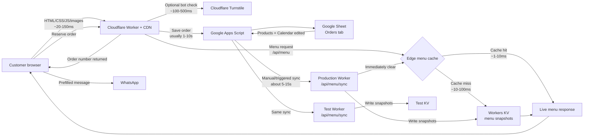

# Swirl Girl Architecture

## Timing guide

| Path | Typical time |
| --- | --- |
| Website assets from Cloudflare | 20-150ms |
| Menu edge-cache hit | 1-10ms |
| Menu cache miss, read from KV | 10-100ms |
| Turnstile verification | 100-500ms |
| Order write through Apps Script to Google Sheets | 1-10 seconds |
| Apps Script menu/calendar sync to production and test | 5-15 seconds |

## Menu update flow

1. Update `Products` or `Calendar` in Google Sheets.
2. Run `syncMenuSnapshot` in Apps Script.
3. Apps Script sends snapshots to production and test Workers.
4. Each Worker updates KV and clears its edge menu cache.
5. The next visitor receives the new menu immediately; later visitors use the fast edge cache.
