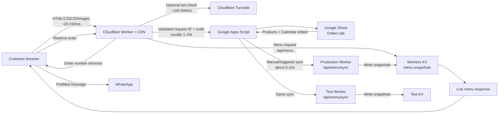

# Swirl Girl Architecture

## Timing guide

| Path | Typical time |
| --- | --- |
| Website assets from Cloudflare | 20-150ms |
| Published menu read from KV | 10-100ms |
| Turnstile verification | 100-500ms |
| Order write through Apps Script to Google Sheets | 1-10 seconds |
| Apps Script menu/calendar sync to production and test | 5-15 seconds |

## Menu update flow

1. Update `Products` or `Calendar` in Google Sheets.
2. Run `syncMenuSnapshot` in Apps Script.
3. Apps Script sends snapshots to production and test Workers.
4. Each Worker updates its environment's KV snapshot.
5. Each menu request reads the published KV value; the legacy unseeded fallback
   alone may use a short edge cache.

## Order write flow

1. The browser creates one UUID request ID and submits structured product IDs
   and quantities; display strings and totals are not authoritative.
2. The Worker validates size, shape, origin, contact and fulfilment fields,
   menu availability, prices, quantities, batch, and Turnstile when configured.
3. Apps Script takes the order lock and checks `Request ID` before inventory.
   An exact replay returns its original reference without consuming stock again.
4. For a new ID, Apps Script recalculates availability and price from current
   Sheet data while still holding the lock, then appends one canonical row.
